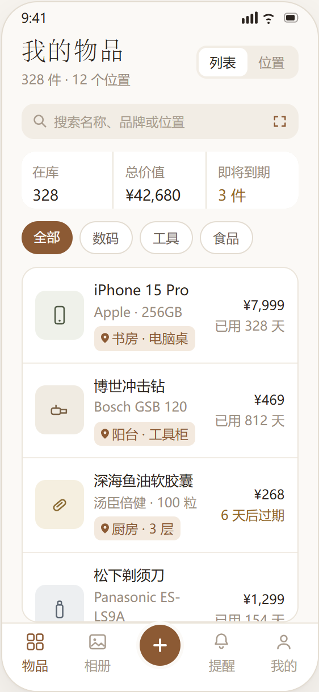
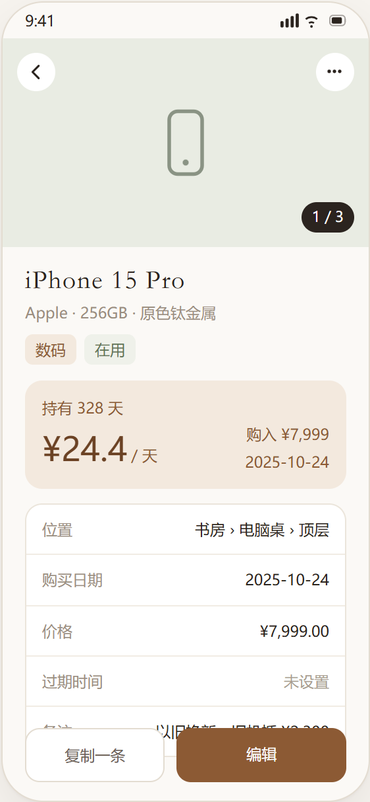
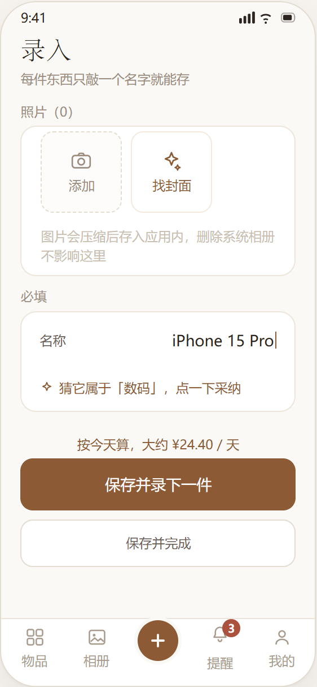
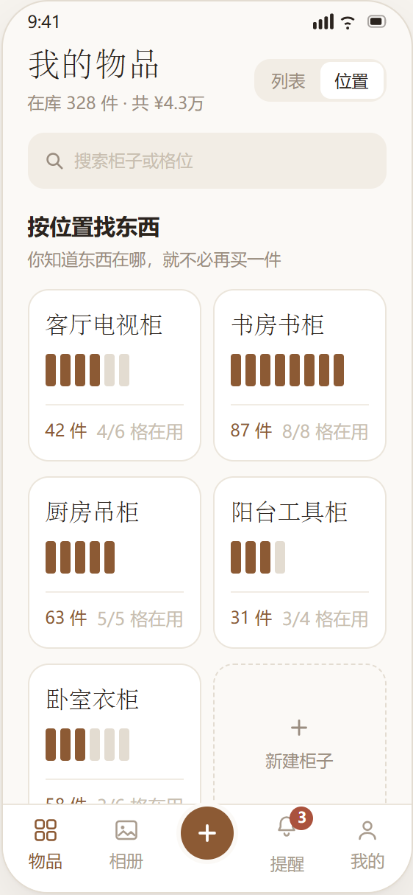
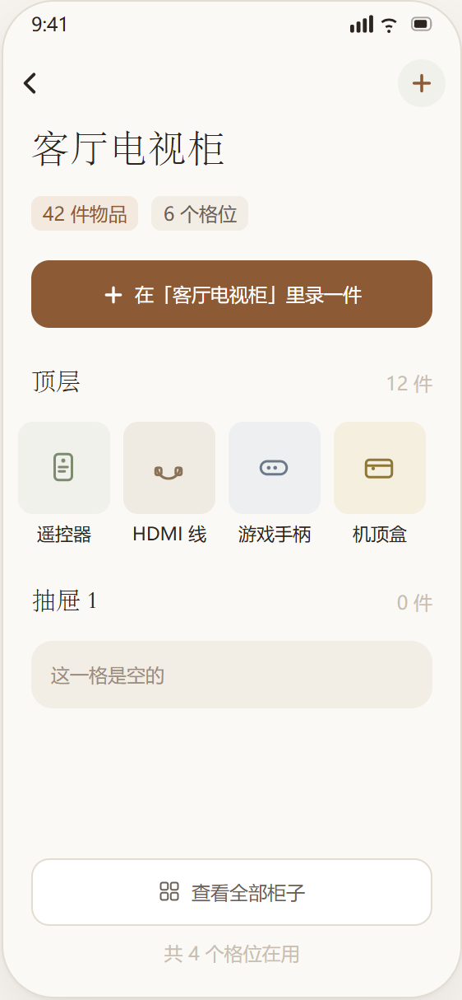
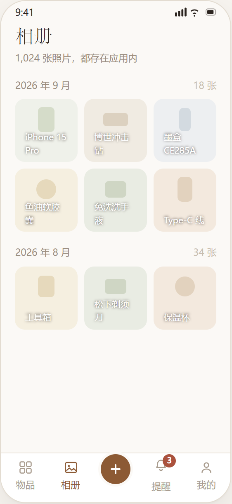
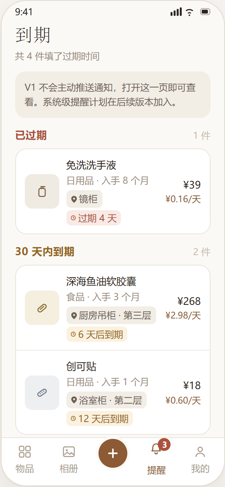
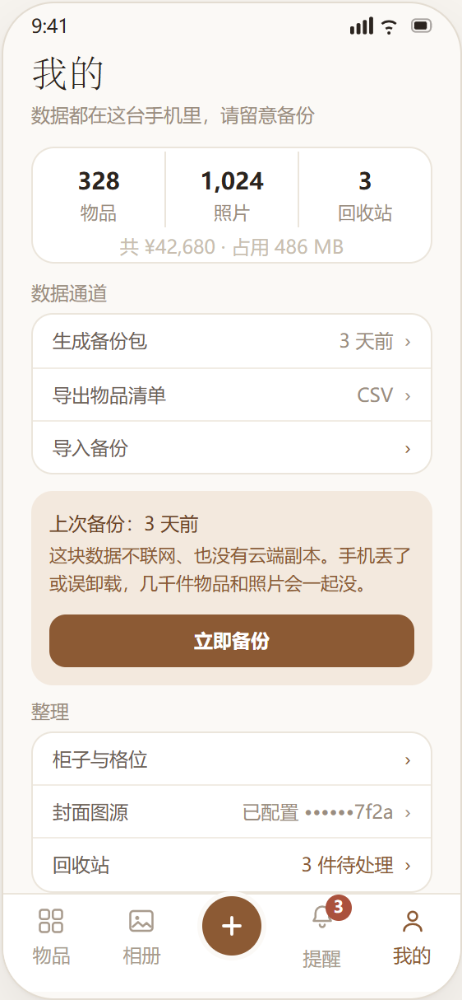
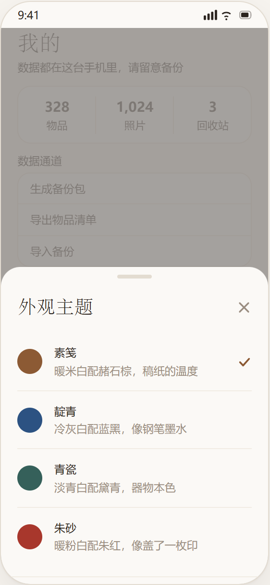

# 格物 · 收纳柜

记录家里每一件东西，找到它们，并且知道它们值不值。

纯本地运行的 Android App，不联网、不注册、无云端。数据全部存在手机里。

---

## 界面

九屏，按使用动线排列。设计语言是**暖棕纸感**：衬线管叙述（页面标题、App 名），
无衬线管数据（条目名、字段值、金额、天数），数字开等宽对齐 —— 金额和天数在列表里
纵向对齐之后，可信度会明显不一样。强调色控得很紧，只出现在「可点的地方」和
「要你看的地方」，其余交给层级与留白。

### 一 · 记下一件东西

<p align="center">
  
  
  
</p>

- **物品列表** —— 搜索常驻，下面概览 / 三色图例 / 分类 / 排序四段随滚动收起。概览给三个数：
  在库 / 总价值 / 即将到期；三色图例（正常 / 将到期 / 已过期）三项互斥、合计等于总数 ——
  用户会拿它对总数，对不上就会怀疑数据错了。右上角「列表 / 位置」是视图切换器，
  位置视图由此进入，不额外占底部标签。
- **物品详情** —— 持有成本卡用品牌浅底、单独成块：摊到多少天、每天多少钱、一句折算说明。
  它是全 App 唯一带情绪回报的信息，混进字段表就会被淹没。价格或购买日期任一缺失时
  **整卡隐藏**，绝不留 `¥0.00 / 天` 这种占位 —— 那会让人以为东西是白来的。
- **连续录入** —— 两个按钮上下叠，主按钮「保存并录下一件」在上、尺寸更大。推进感靠标题下那句回执
  （「刚记下「X」，继续下一件」），不靠进度条。照片给两个入口：「添加」走本地相册，
  「找封面」要联网，用品牌色描边把这两件事分开。批量录入是 V1 成败的关键，
  界面要推着人往前走，而不是引导他退出。

### 二 · 然后找到它

<p align="center">
  
  
  
</p>

- **位置视图** —— 两级结构：柜子 → 格位。柜子卡片上那排竖条就是**格位占用示意**：
  实心＝这一格有东西，浅色＝空着。用方块而不是进度条，是因为方块能传达「第几格」的位置感，
  进度条只传达比例。物品可以只挂到柜子，也可以精确到某一格。
- **柜内格位** —— 按格位分组，每组就是一排 72px 方形图块（缩略图 + 名字），每行几个按窗口宽度算
  （常见机型排 4 个）；空着的格位照样占一行，写「这一格是空的」，位置记录缺失才看得见。
  「找东西」场景的主战场：先想到柜子，再扫一眼格位，不用记编号，也不必先搜索。
- **相册** —— 照片按年月倒序分组，统一正方形裁切，底部压一条白字物品名。加载的是压缩图而非原图 ——
  盘点、理赔、出手时用得上，同时不让相册把手机撑爆。这页没有分类筛选，
  要看某件东西的照片就从它的详情页进。

### 三 · 盯住到期，管好数据

<p align="center">
  
  
  
</p>

- **到期** —— 只列「已过期」和「30 天内到期」两段；30 天以上的只计入顶部总数，不进列表。
  **不做系统推送**：页面顶部那条说明卡必须在，否则用户会以为提醒坏了；系统级提醒留给后续版本。
  底部标签栏「提醒」上的角标与这一页同源（已过期 + 30 天内），点进去之前就知道有几件要处理。
- **我的** —— 备份状态置顶、单独用品牌浅底、按钮占满整行。纯本地方案里这是唯一的救命绳，
  不能藏在三级菜单里。三个数据出口（生成备份包 / 导出 CSV 清单 / 导入备份）收在一组，
  回收站归到「整理」，再往下是「外观」（主题入口 + 五枚色点）与「关于」。
- **主题** —— 四套浅色任选（素笺 / 靛青 / 青瓷 / 朱砂），底部弹层列出，每行前面那枚圆点取该套主题的品牌色。
  深色档「玄夜」**不进选择列表**：它是系统深色时的接管档，自动生效，
  而用户的浅色选择会留着 —— 白天切回来还是那套。

> 以上是界面设计稿，源文件 `docs/screens.html`，已与 v1.3.0 的实现逐屏核对。
> 图由无头 Chrome 渲染该 HTML 产出；文件名取自每屏 `<figure data-slug>`，改完设计重跑一次即可更新：
>
> ```
> python ~/.workbuddy/skills/readme-product-screens/scripts/export_screens.py docs/screens.html docs/screenshots
> ```
>
> 手机框固定 280×606，长页面只能画首屏 —— 每屏图注里写明了被裁掉的是哪几段。

---

## 功能范围（V1）

| 模块 | 内容 |
|---|---|
| 录入 | 名称唯一必填，其余选填；连续录入模式；按名称自动猜分类；按分类带出保质期 |
| 组织 | 物品列表、模糊搜索、按分类筛选、按柜子/格位筛选 |
| 位置 | 两级结构：柜子 → 格位；柜内格位视图；占用示意 |
| 相册 | 全部照片按年月分组浏览 |
| 到期 | 应用内到期清单（按已过期 / 30 天内 / 更远分组），**不做系统推送** |
| 持有成本 | 详情页显示持有天数与日均成本（实时计算，不落库） |
| 数据通道 | 备份包（zip，可完整还原）、导出 CSV、导入（可选覆盖或合并） |
| 回收站 | 软删除，可恢复或彻底清除 |

---

## 怎么在手机上跑起来

不需要安装 Android SDK，也不需要连数据线。

1. 手机应用商店搜索 **Expo Go** 并安装（Android / iOS 都有）。
2. 手机和电脑连**同一个 WiFi**（关键：必须在同一网段，否则扫码也连不上）。
3. 在本目录下执行任一种：

   - 双击 `start-dev.cmd`（Windows 一键启动）
   - 或在命令行执行：

     ```bash
     npm start
     ```

4. 终端会显示一个二维码。用手机上的 **Expo Go** 扫码即可打开。
   - Android 版 Expo Go 自带扫码入口
   - 若扫码失败，也可在 Expo Go 里手动输入终端显示的 `exp://<电脑IPv4>:8081`

改代码后手机会自动热更新，不用重新扫码。

### 扫码连不上怎么办

| 现象 | 原因 | 处理 |
|---|---|---|
| 一直转圈 / 报 `Timeout` | 手机与电脑不在同一网段 | 查 `ipconfig` 确认电脑当前活动网卡的 IPv4，让手机连同一个 WiFi |
| 公司/校园网下必然失败 | 网络做了客户端隔离，设备互相不可见 | 改用隧道模式：`npm start -- --tunnel`（走公网中转，首次会慢些） |
| 换了网络后地址失效 | IP 变了 | 重启服务，重新扫码 |

> 电脑上若有多个网卡（Hyper-V、虚拟网卡等），Expo 可能广播错地址。
> 以终端实际打印的 `exp://…` 为准，不要凭印象输入。


## 本地配置

`.env` 存本地环境变量，**不入版本库**；模板见 `.env.example`。

| 变量 | 用途 |
|---|---|
| `EXPO_PUBLIC_PEXELS_API_KEY` | 「我的 → 封面图源」的网图检索（[Pexels](https://www.pexels.com/api/)） |

留空也能正常构建 —— 首次使用时在 App 里填一次即可，会存进本地数据库
（「我的 → 封面图源」）。改了 `.env` 需要重启 Metro 才生效。

> 该变量在打包时被内联进 JS bundle，装了包就能反编译提取。
> 所以正式分发的包不应带 Key，只适合自用构建。


## 怎么打出一个能装进手机的 APK

走**本地构建**，不使用 Expo 云构建。需要 JDK 17 + Android SDK。

```bash
cd android
gradlew.bat assembleRelease --no-daemon --console=plain --no-parallel
```

产物在 `android/app/build/outputs/apk/release/app-release.apk`，
传到手机安装即可（需允许"安装未知来源应用"）。

> 串行构建（`--no-parallel`）是为了绕开安全软件偶发拦截 Gradle 缓存。
> 增量构建约 6～8 分钟，首次全量或清缓存后会到 20 分钟以上。

### 签名配置（换机器必读）

**签名密钥与口令不入版本库**，克隆后需要自行补齐：

| 文件 | 入库 | 说明 |
|---|---|---|
| `android/app/gewu-release.keystore` | ❌ | release 签名密钥。**换密钥将导致无法覆盖安装已发布的版本** |
| `android/key.properties` | ❌ | 密钥口令，格式见 `android/key.properties.example` |
| `android/local.properties` | ❌ | 本机 Android SDK 路径，模板见 `android/local.properties.example` |

> ⚠️ 缺失 `key.properties` 时构建**不会中断**，会静默回落到 debug 签名 ——
> 打出来的包签名不符，装不上已经装了正式版的手机。打完包务必用
> `apksigner verify --verbose` 确认签名，这一步不加 `--verbose` 时通过也不打印任何字样。

### 版本号只有一个来源

**`app.json` 是唯一真相**，`build.gradle` 现读它，不要手抄：

- `app.json` → `expo.version`（如 `1.3.0`）与 `expo.android.versionCode`（如 `6`）
- `android/app/build.gradle` 通过 `JsonSlurper` 读上一级的 `app.json`，
  构建日志里会打出 `versionName=1.3.0  versionCode=6`，搜这行即可当场确认

这么改是因为手抄已经出过一次事：`app.json` 早就是 1.0.0 了，manifest 却停在
`versionCode 1` —— **构建不报错**，只打出一个自相矛盾的包，而 `versionCode` 卡住不动
才是真正要命的（决定能不能覆盖安装）。

界面上的版本号从 `Constants.expoConfig.version` 取，**不硬编码**；
`grep -rn "1\.[0-9]\.[0-9]" src/` 应当为空。

> ⚠️ `build.gradle` 是 `prebuild` 的产物。真有一天重跑 prebuild，这段会被覆盖 ——
> 但那一刻 prebuild 也会按 `app.json` 正确写版本号，不会更糟。

## 目录结构

```
src/
  app/                     页面（expo-router 文件路由）
    _layout.tsx            根 Stack + 数据库预热
    (tabs)/                五个底部标签页
      index.tsx            物品（列表 / 位置双视图）
      album.tsx  compose.tsx  alerts.tsx  mine.tsx
    item/[id]/             详情、编辑
    cabinet/               柜子管理、柜内格位
    trash.tsx              回收站
  components/
    TabBar.tsx             自定义底部标签栏
    ui/                    排版、布局、控件、反馈等原子件
    domain/                业务组件（物品行、柜子网格、表单、各类选择器）
  constants/theme.ts       设计令牌（色板 / 字级 / 间距 / 圆角）
  lib/
    db/                    SQLite 建表与四张表的仓储
    photos/                图片压缩、缩略图、沙盒落盘
    backup/                备份包、CSV 导出、导入
    date.ts format.ts      派生指标与格式化
    suggest.ts             分类猜词词典
    store/                 全局状态（数据版本 + 角标统计）
```

## 几条不能改坏的约定

- **主键必须是 UUID**：导入支持「合并」，自增 ID 在两份备份合并时必然撞车。
- **图片必须落进 App 沙盒**（`Paths.document/photos`），不能只存相册引用 —— 否则用户清理相册后照片全变白框。
- **派生指标不落库**：持有天数、日均成本在展示时实时计算；数据为空时整块隐藏，绝不显示 `¥0.00/天`。
- **删除是软删除**：先入回收站，彻底删除时才清照片文件。
- **备份与导出是两条通道**：备份给机器读（zip，可还原），导出给人看（CSV，Excel 能开）。

## 品牌素材

<p align="center">
  
</p>

`assets/images/` 下的成品全部由脚本生成，没有手工图
（`_preview_dark.png` 是深色档预览，不参与构建）：

| 文件 | 尺寸 | 用途 |
|---|---|---|
| `icon.png` | 1024×1024 | 主图标（iOS / 网页 / 备用），满幅方形不烤圆角 |
| `android-icon-foreground.png` | 1024×1024 | 安卓自适应前景（透明底 + 赭石棕「格」） |
| `android-icon-monochrome.png` | 1024×1024 | 安卓主题图标（单色 + alpha，系统自行上色） |
| `splash-icon.png` | 1024×1024 | 启动图，配置为 132pt |
| `favicon.png` | 64×64 | 网页 favicon |

要改图标，**改脚本再重新生成，不要直接 P 图**。需要 Pillow 与 Windows 的华文中宋
（`C:\Windows\Fonts\STZHONGS.TTF`）：

```bash
python tools/make_icons_final.py     # 1. 生成 assets/images/ 下的素材
python tools/sync_android_icons.py   # 2. 同步到 android/app/src/main/res/ 原生资源
```

> ⚠️ **两步缺一不可。** 安卓桌面实际读的是 `android/app/src/main/res/` 下的原生资源
> （prebuild 产物），只改 `assets/images/` 和 `app.json` 不会生效。
> 同时 `app.json` 的 `android.adaptiveIcon.backgroundColor` 与
> `res/values/colors.xml` 的 `iconBackground` 要一起改。
>
> **只认上面这两个脚本。** 探索期的其余图标脚本（`make_icons.py` / `_v2` / `round_v2.py` /
> `font_probe.py` / `mock_desktop.py` / `preview_desktop.py` / `sync_android_icons.js`）、
> 早期的「朱印」方案 `scripts/build-icons.py`，以及当时的比对截图
> `tools/preview/`，都已归档到 `tools/_archive/`。它们记录了方案怎么选出来的，
> 但不参与维护，也不参与 lint —— 不要照着改。

设计规格（v3 定稿）：暖米白底 `#F7F4EF` + 赭石棕 `#8C5A34` 中宋「格」字，
墨迹框占画布 **44%**，笔画做 2.2px 膨胀加粗 —— 中宋笔画细，缩到 48px 以下会散架，
膨胀能在不改变字形骨架（横细竖粗、撇捺出锋）的前提下把笔画压实。

> **Expo Go 里看不到这些图。** Expo Go 用的是它自己的图标和启动屏，
> 换成「格物」图标必须出一个独立 APK。改完图标也不必重启开发服务器，对 Expo Go 无影响。


## 技术栈

Expo SDK 57 · React Native 0.86 · React 19 · expo-router 57 · TypeScript · expo-sqlite

设计语言：暖棕纸感（品牌色 `#8C5A34`），衬线管叙述、无衬线管数据，数字开等宽对齐。

---

## 版本管理

### 什么入库、什么不入库

| 入库 | 不入库（`.gitignore` 排除） |
|---|---|
| `src/`、`assets/`、`tools/`、`scripts/` | `node_modules/`、`.expo/` |
| `android/` 的原生配置源码 | `android/app/build/`、`android/app/.cxx/`、`android/build/`、`android/.gradle/` |
| `app.json`、`package.json`、`tsconfig.json`、`eslint.config.js` | `android/key.properties`、`android/local.properties` |
| `.env.example`、`android/*.example` | `.env`、`*.keystore`、`*.jks` |

> `android/` **必须入库**：里面有手工维护的签名配置、权限调整（`tools:node="remove"`
> 移除录音与悬浮窗权限）、图标原生资源和 arm64 单架构设定。
> 一旦重新跑 `expo prebuild`，这些改动会被覆盖 —— **发版时不要 prebuild**。
> 版本号也不用手工同步两处：`build.gradle` 现读 `app.json`（见上）。

### 发一个版本

1. 只改 `app.json` 的 `version` / `android.versionCode`（唯一真相）；
   构建日志里搜 `versionName=` 确认 `build.gradle` 跟上了
2. 构建：`cd android && gradlew.bat assembleRelease --no-daemon --console=plain --no-parallel`
3. 校验：`aapt2 dump badging`（版本 / 架构 / 权限）、`apksigner verify --verbose`（签名）
4. 提交并打标签：

   ```bash
   git add -A
   git commit -m "release: v1.3.0"
   git tag -a v1.3.0 -m "格物 v1.3.0"
   git push origin main --tags
   ```

> 同版本号重打时版本串失去区分力，改用「差分 + 归因」：
> 确认 `createBundleReleaseJsAndAssets` 非 UP-TO-DATE，再扫基线之后被改的源文件
> （本机 `find -newermt` 静默失效，用 Python `st_mtime`），最后新旧 bundle 逐字节比。
