# 格物 · 收纳柜

记录家里每一件东西，找到它们，并且知道它们值不值。

纯本地运行的 Android App，不注册、无云端、没有统计 SDK。数据全部存在手机里；
除你主动打开的 AI 助手与「找封面」外，不发起任何网络请求。

---

## 界面

十五屏，按使用动线排列 —— 前十屏是一条完整的动线（记下 → 找到 → 盯住），
后五屏是后加的「用掉一件 / 补一件」与 AI 助手（识物 / 问一问 / 语音）。
设计语言是**暖棕纸感**：衬线管叙述（页面标题、App 名），
无衬线管数据（条目名、字段值、金额、天数），数字开等宽对齐 —— 金额和天数在列表里
纵向对齐之后，可信度会明显不一样。强调色控得很紧，只出现在「可点的地方」和
「要你看的地方」，其余交给层级与留白。

### 一 · 记下一件东西

<p align="center">
  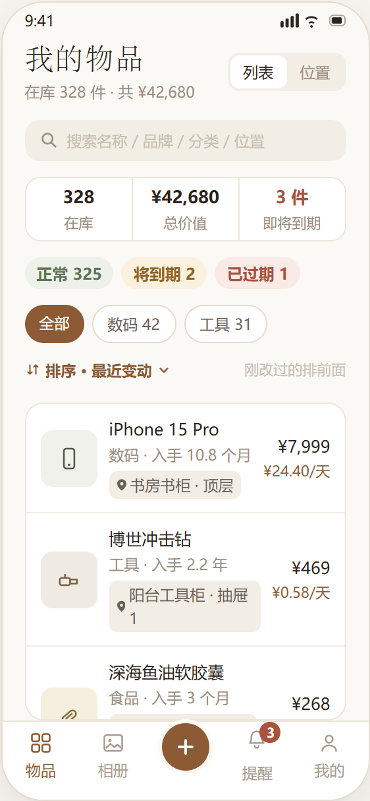
  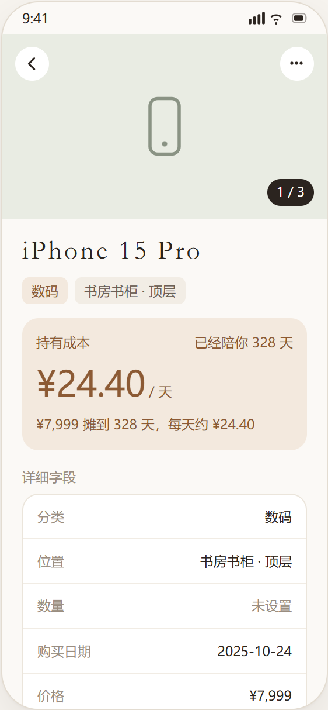
  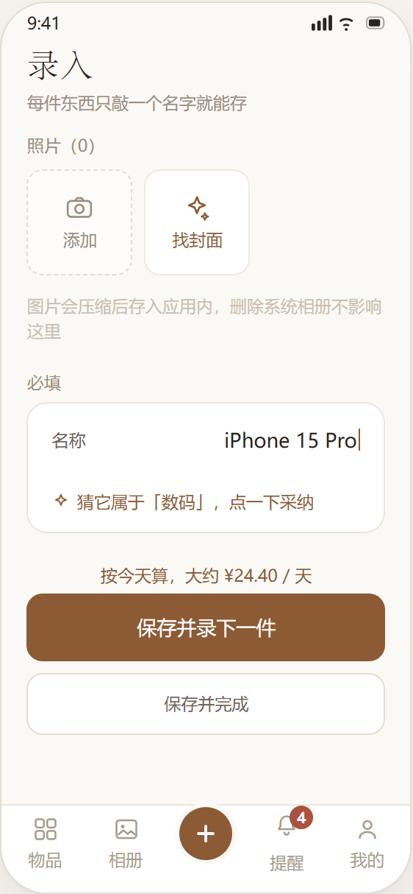
</p>

- **物品列表** —— 搜索常驻，下面概览 / 三色图例 / 分类 / 排序四段随滚动收起。概览给三个数：
  在库 / 总价值 / 即将到期；三色图例（正常 / 将到期 / 已过期）三项互斥、合计等于总数 ——
  用户会拿它对总数，对不上就会怀疑数据错了。右上角「列表 / 位置」是视图切换器，
  位置视图由此进入，不额外占底部标签。启用了库存的物品，行尾多一枚**只说数、不能点**的
  余量胶囊（剩 1 / 剩 3 / 用完）；**整行上没有加减按钮**——胶囊本身就是按钮，
  点它才从底部滑出快捷面板。概览里的「即将到期」是**到期口径**，标签栏角标是**待办口径**
  （快到期的并上该补货的、去重后计数）——两个口径各有各的用途，角标必须等于提醒页里
  能数出来的行数。设计稿这一版两数恰好都是 4，只是因为该补货的那件同时也快到期、去重后没多出来。
- **物品详情** —— 持有成本卡用品牌浅底、单独成块：摊到多少天、每天多少钱、一句折算说明。
  它是全 App 唯一带情绪回报的信息，混进字段表就会被淹没。价格或购买日期任一缺失时
  **整卡隐藏**，绝不留 `¥0.00 / 天` 这种占位 —— 那会让人以为东西是白来的。
  详细字段里固定有一行「数量」，没填就显示「未设置」——**未设置＝单件，不是 0**，
  所以老用户升级后行为一个字节都不变。启用了库存的东西，照片正下方（成本卡之上）
  会多出一张库存卡，见 12 屏。
- **连续录入** —— 两个按钮上下叠，主按钮「保存并录下一件」在上、尺寸更大。推进感靠标题下那句回执
  （「刚记下「X」，继续下一件」），不靠进度条。照片给两个入口：「添加」走本地相册，
  「找封面」要联网，用品牌色描边把这两件事分开。批量录入是 V1 成败的关键，
  界面要推着人往前走，而不是引导他退出。

### 二 · 然后找到它

<p align="center">
  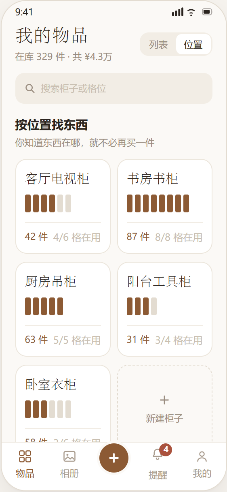
  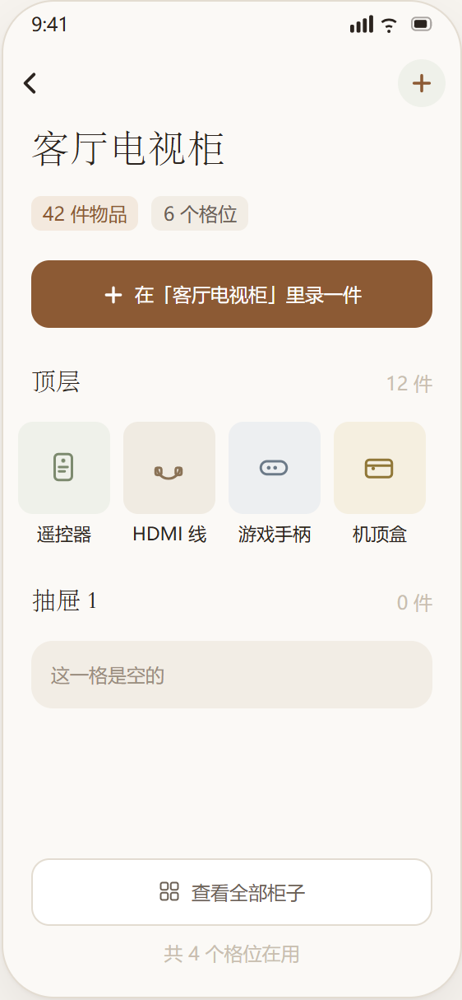
  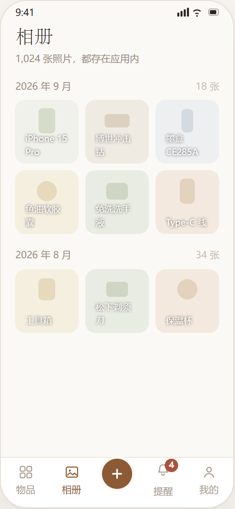
</p>

- **位置视图** —— 两级结构：柜子 → 格位。柜子卡片上那排竖条就是**格位占用示意**：
  实心＝这一格有东西，浅色＝空着。用方块而不是进度条，是因为方块能传达「第几格」的位置感，
  进度条只传达比例。物品可以只挂到柜子，也可以精确到某一格。
- **柜内格位** —— 按格位分组，每组就是一排 72px 方形图块（缩略图 + 名字），每行几个按窗口宽度算
  （常见机型排 4 个）；空着的格位照样占一行，写「这一格是空的」，位置记录缺失才看得见。
  「找东西」场景的主战场：先想到柜子，再扫一眼格位，不用记编号，也不必先搜索。
- **相册** —— 照片按年月倒序分组，统一正方形裁切，底部压一条白字物品名。加载的是压缩图而非原图 ——
  盘点、理赔、出手时用得上，同时不让相册把手机撑爆。这页没有分类筛选，
  要看某件东西的照片就从它的详情页进。

### 三 · 盯住到期，管好数据

<p align="center">
  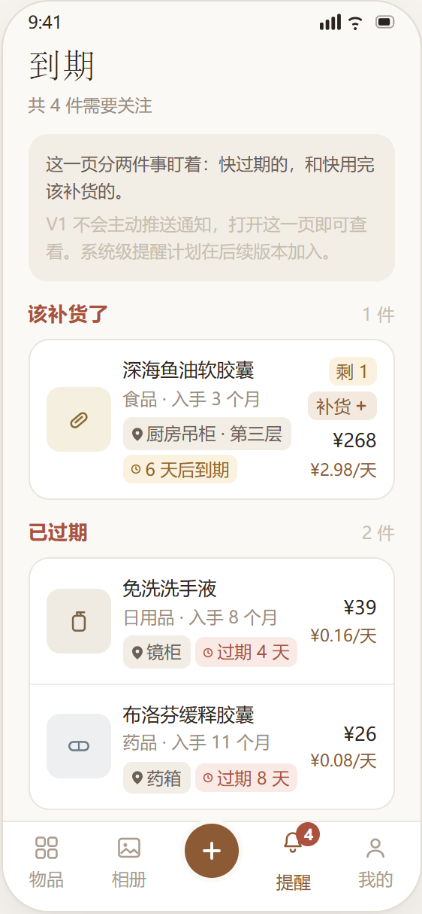
  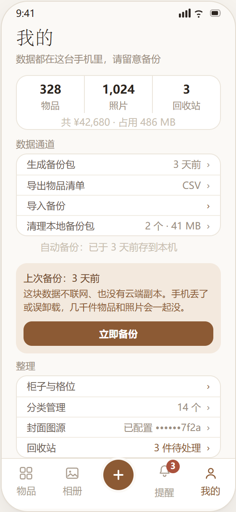
</p>

<p align="center">
  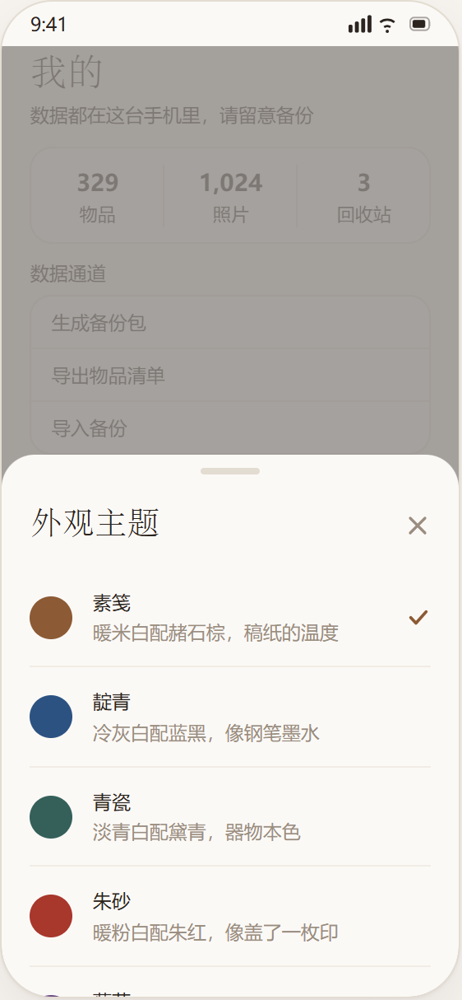
  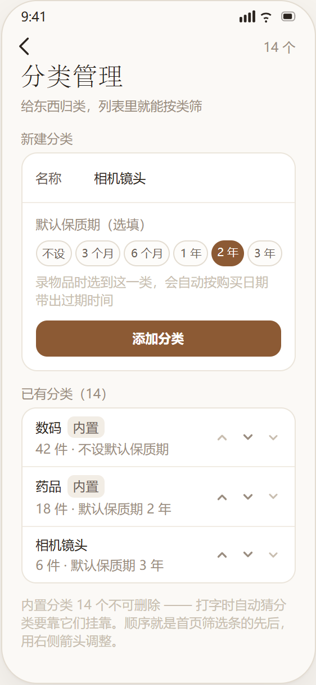
</p>

- **到期** —— 这一页盯两件事：**快过期的**与**快用完该补货的**，两者共用同一套分组列表与行组件，
  只是排在最前面的那个组换了人（「该补货了」→「已过期」→「30 天内到期」；更远的只存在库里，不进列表）。
  **不做系统推送**：页面顶部那条说明卡必须在 —— 一句说这一页盯什么，一句说 V1 不做推送，
  不写清楚用户会以为提醒坏了。只有「该补货了」这一组在行尾给「补货 +」：补一件最坏是数多了，
  点一下「用掉一件」就回来了；而首页列表上的 −1 是反过来的，误触就真的少一件、还得去翻撤销条 ——
  这里给 1 步，那里给 2 步。底部标签栏「提醒」上的角标与这一页同源（上面几组**去重**后的件数），
  点进去之前就知道有几件事要处理。
- **我的** —— 备份状态置顶、单独用品牌浅底、按钮占满整行。纯本地方案里这是唯一的救命绳，
  不能藏在三级菜单里。数据通道卡上四行（生成备份包 / 导出物品清单 / 导入备份 / 清理本地备份包）收在一组，
  「整理」放柜子与格位、分类管理、封面图源、回收站四条，再往下是「外观」（主题入口 + 五枚色点）与「关于」。
  **自动备份与手动备份刻意分两行显示**：自动那份只是本机 cache 里的回滚副本，
  手动那份要包离开了手机才算真防丢 —— 合并成一行会让人误以为已经安全了。
- **主题** —— 六套浅色，底部弹层列出，每行前面那枚圆点取该套主题的品牌色。
  **素笺 / 靛青 / 青瓷免费**，朱砂 / 藕荷 / 胭脂属支持者档（列表按下这个顺序排，
  前三个不带标、后三个带标，分界一眼可见）。
  深色档「玄夜」**不进选择列表**：它是系统深色时的接管档，自动生效，
  而用户的浅色选择会留着 —— 白天切回来还是那套。
- **分类管理** —— V1 早先只做到「能选」，十四个内置分类改不了、加不了、删不掉。这一页补上新建 / 改名 /
  排序 / 删除，并把**默认保质期**收在这里（录入页只消费它）。三条规矩写在界面上：内置分类
  **不可删、但可以改名**——猜词要靠内置分类挂靠，可「数码」「五金」未必贴合每个人的生活；
  排序走行右侧的上下箭头，顺序就是首页筛选条的先后；改内置分类的名字时会亮一行琥珀色提示，
  说明改名后这一类不再自动猜中（猜词词典按种子原名建索引），不藏着。

### 四 · 用掉一件，补一件

<p align="center">
  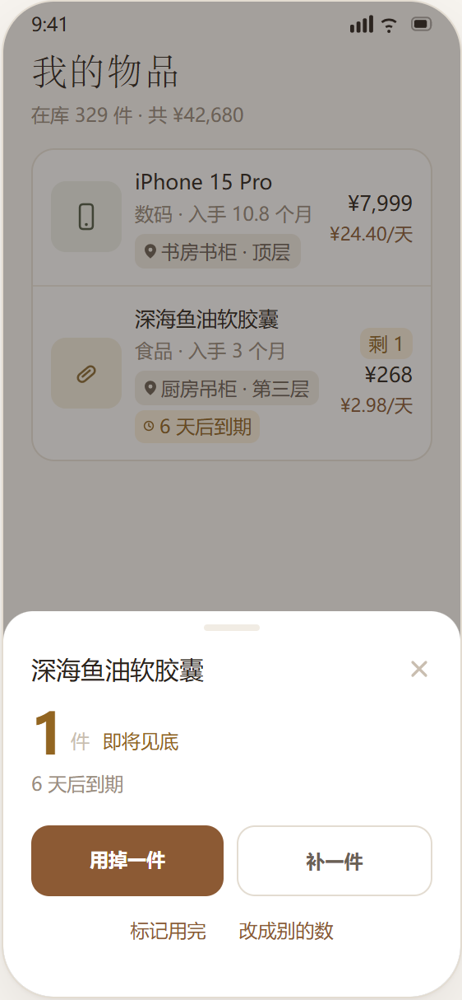
  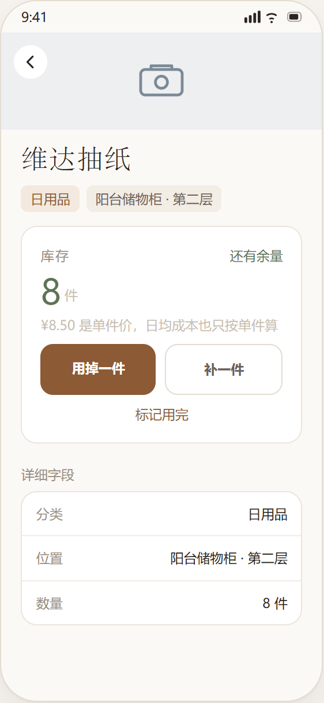
</p>

- **库存快捷面板** —— 列表行尾那枚「剩 1」是**只读的**：不点它，整行上没有任何东西能改数量。
  点开才从底部滑出面板，「用掉一件」用品牌色实底（主操作），「补一件」用描边 ——
  减法是更容易做错的方向，所以给它更重的位置、也更难误触。面板按完**不自动关**：
  连用两件是常见动作，自动关会把两步变成四步。最下面两个小字链接才是「标记用完」与
  「改成别的数」，都不常用，所以都不抢眼。
- **详情页库存卡** —— 坐在照片正下方、持有成本卡之上，一屏之内抬手就能点。三个信息一眼看全：
  还剩几件、什么状态（还有余量 / 即将见底 / 已用完）、单件多少钱。**均价只按单件算**，
  数量不参与 —— 「8 件共 ¥68」摊到每天一分钱，那是在自欺欺人。数量没填的东西（单件物品）
  整张卡不出现，详情页与从前一模一样。

### 五 · AI 助手：事实来自本机，模型只负责把话说顺

<p align="center">
  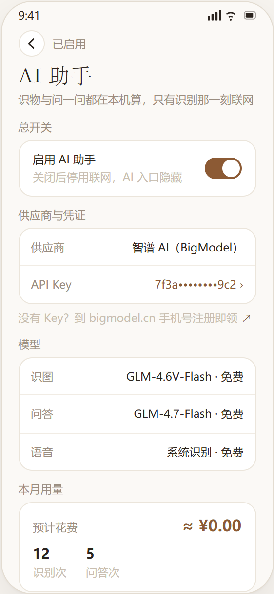
  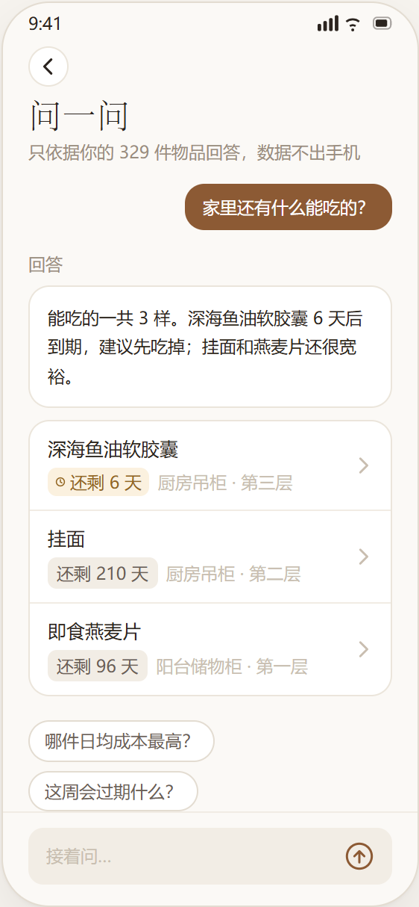
  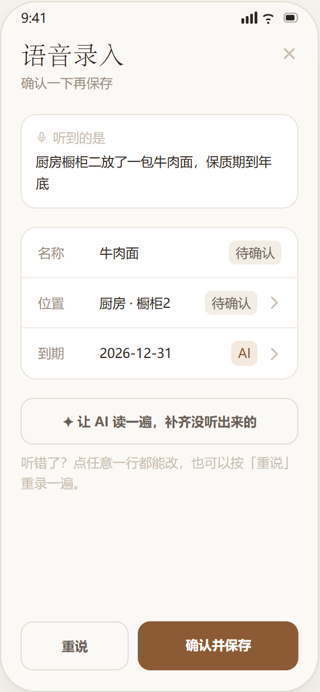
</p>

- **AI 设置页** —— 顺序是「总开关 → 凭证 → 模型 → 用量 → 隐私」，先答「要不要花钱、会不会
  偷偷联网」，再轮到「Key 怎么填」。两个模型都是官方免费档，这一行**写在模型行上，不藏在说明里**。
  **语音单独一行**——它不需要 Key、不联网、也不申请麦克风权限（走系统识别对话框），
  不写清这一点，用户会以为「关掉总开关就没有语音录入」。它与识物、问答同属**支持者档**，
  但走的是系统对话框、不消耗任何调用量。用量卡让用户随时看见花了多少钱，
  他才有底气把开关一直开着；这里恒为 `¥0.00`，但那个数字由 `estimateMonthlyCost` 算出来
  而不是写死 —— 将来换一档模型，它会自己变。
- **问一问** —— 入口在物品列表搜索框右侧那枚星标，**不占底部第六格**。最重要的约束是：
  **答案必须落到具体物品卡片上，不接受纯文字答案。** 结构上分两层：下面那几张卡片由本机
  检索直接给出（事实层，模型碰不到），上面那句话才是模型写的（措辞层）—— 模型胡说的话，
  卡片一眼就能对不上。三条降级路径都不打断使用：没配 Key → 照样答，用本机检索那句事实；
  模型超时 → 静默退回本机事实，不弹错误；库是空的 → 说「先记几件东西再来问」并给出录入出口。
  **AI 挂了这个功能还在。**
- **语音录入**（支持者档）—— 一句话 → 一组字段，然后停下来等你确认。**绝不直接入库**；没听懂的行写
  「未识别」并留出改的入口，不拿猜出来的值冒充听懂了。行尾那枚小标的两种含义必须分得开：
  「待确认」＝本地规则听出来的，「AI」＝模型补出来的。**AI 只补空着的行、绝不覆盖已有值**，
  而且位置不参与 —— 模型不知道你的柜子叫什么。待机态那条波形是**装饰不是音量表**：
  走系统识别时录音在另一个进程里，拿不到音频数据，所以只做匀速呼吸的错相动画。

> **AI 是「支持者档」的一部分，而且默认关着。** Key 是你自己的（到 bigmodel.cn 手机号注册
> 即领免费额度），格物不代出 Key、不按量收费、不自建代理；识别时上传的只是长边 ≤1024px 的
> 压缩副本，原图与物品数据不出手机。免费档的录入、到期、库存、照片与备份一个不少。

> 以上是界面设计稿，源文件 `docs/screens.html`，已与 v2.0.0 的实现逐屏核对。
> 图由无头 Chrome 渲染该 HTML 产出；文件名取自每屏 `<figure data-slug>`，改完设计重跑一次即可更新：
>
> ```
> python ~/.workbuddy/skills/readme-product-screens/scripts/export_screens.py docs/screens.html docs/screenshots
> ```
>
> 手机框固定 280×606，长页面只能画首屏 —— 每屏图注里写明了被裁掉的是哪几段。

---

## 功能范围（V1）

| 模块 | 内容 |
|---|---|
| 录入 | 名称唯一必填，其余选填；连续录入模式；按名称自动猜分类；按分类带出保质期；详情页一键复制为新物品 |
| 组织 | 物品列表、模糊搜索、按分类筛选、按柜子/格位筛选 |
| 分类 | 新建 / 改名 / 排序 / 删除，每类可设默认保质期；内置分类不可删但可改名 |
| 位置 | 两级结构：柜子 → 格位；柜内格位视图；占用示意 |
| 相册 | 全部照片按年月分组浏览 |
| 库存 | 物品可填数量（**留空＝单件**）；列表行尾一枚只读余量胶囊、点开底部面板「用掉一件 / 补一件」；详情页库存卡 |
| 到期 | 应用内清单：「该补货了」/ 已过期 / 30 天内到期，**不做系统推送** |
| 持有成本 | 详情页显示持有天数与日均成本（实时计算，不落库） |
| AI 助手 | **默认关闭**。拍照识物自动填表 / 问一问 / 语音录入。事实全部来自本机检索，模型只负责措辞；Key 由用户自备（BYOK），识别时只上传 ≤1024px 压缩副本。属**支持者档** |
| 支持者档 | ¥36 一次买断。激活码走 Ed25519 **离线验签**：不联网、不绑设备、不限台数；解锁 AI 入口、语音、朱砂 / 藕荷 / 胭脂三套皮肤、统计洞察 |
| 数据通道 | 备份包（zip，可完整还原）、导出 CSV、导入（可选覆盖或合并）、启动时自动备份、历史包清理 |
| 回收站 | 软删除，可恢复或彻底清除 |

---

## 怎么在手机上跑起来

不需要安装 Android SDK，也不需要连数据线。

1. 手机应用商店搜索 **Expo Go** 并安装（Android / iOS 都有）。
2. 手机和电脑连**同一个 WiFi**（关键：必须在同一网段，否则扫码也连不上）。
3. 在本目录下执行任一种：

   - 双击 `start-dev.cmd`（Windows 一键启动）
   - 或在命令行执行：

     ```bash
     npm start
     ```

4. 终端会显示一个二维码。用手机上的 **Expo Go** 扫码即可打开。
   - Android 版 Expo Go 自带扫码入口
   - 若扫码失败，也可在 Expo Go 里手动输入终端显示的 `exp://<电脑IPv4>:8081`

改代码后手机会自动热更新，不用重新扫码。

### 扫码连不上怎么办

| 现象 | 原因 | 处理 |
|---|---|---|
| 一直转圈 / 报 `Timeout` | 手机与电脑不在同一网段 | 查 `ipconfig` 确认电脑当前活动网卡的 IPv4，让手机连同一个 WiFi |
| 公司/校园网下必然失败 | 网络做了客户端隔离，设备互相不可见 | 改用隧道模式：`npm start -- --tunnel`（走公网中转，首次会慢些） |
| 换了网络后地址失效 | IP 变了 | 重启服务，重新扫码 |

> 电脑上若有多个网卡（Hyper-V、虚拟网卡等），Expo 可能广播错地址。
> 以终端实际打印的 `exp://…` 为准，不要凭印象输入。


## 本地配置

`.env` 存本地环境变量，**不入版本库**；模板见 `.env.example`。

| 变量 | 用途 |
|---|---|
| `EXPO_PUBLIC_PEXELS_API_KEY` | 「我的 → 封面图源」的网图检索（[Pexels](https://www.pexels.com/api/)） |

留空也能正常构建 —— 首次使用时在 App 里填一次即可，会存进本地数据库
（「我的 → 封面图源」）。改了 `.env` 需要重启 Metro 才生效。

> 该变量在打包时被内联进 JS bundle，装了包就能反编译提取。
> 所以正式分发的包不应带 Key，只适合自用构建。


## 怎么打出一个能装进手机的 APK

走**本地构建**，不使用 Expo 云构建。需要 JDK 17 + Android SDK。

```bash
cd android
gradlew.bat assembleRelease --no-daemon --console=plain --no-parallel
```

产物在 `android/app/build/outputs/apk/release/app-release.apk`，
传到手机安装即可（需允许"安装未知来源应用"）。

> 串行构建（`--no-parallel`）是为了绕开安全软件偶发拦截 Gradle 缓存。
> 增量构建约 6～8 分钟，首次全量或清缓存后会到 20 分钟以上。

### 签名配置（换机器必读）

**签名密钥与口令不入版本库**，克隆后需要自行补齐：

| 文件 | 入库 | 说明 |
|---|---|---|
| `android/app/gewu-release.keystore` | ❌ | release 签名密钥。**换密钥将导致无法覆盖安装已发布的版本** |
| `android/key.properties` | ❌ | 密钥口令，格式见 `android/key.properties.example` |
| `android/local.properties` | ❌ | 本机 Android SDK 路径，模板见 `android/local.properties.example` |

> ⚠️ 缺失 `key.properties` 时构建**不会中断**，会静默回落到 debug 签名 ——
> 打出来的包签名不符，装不上已经装了正式版的手机。打完包务必用
> `apksigner verify --verbose` 确认签名，这一步不加 `--verbose` 时通过也不打印任何字样。

### 版本号只有一个来源

**`app.json` 是唯一真相**，`build.gradle` 现读它，不要手抄：

- `app.json` → `expo.version`（如 `1.3.1`）与 `expo.android.versionCode`（如 `7`）
- `android/app/build.gradle` 通过 `JsonSlurper` 读上一级的 `app.json`，
  构建日志里会打出 `versionName=1.3.1  versionCode=7`，搜这行即可当场确认

这么改是因为手抄已经出过一次事：`app.json` 早就是 1.0.0 了，manifest 却停在
`versionCode 1` —— **构建不报错**，只打出一个自相矛盾的包，而 `versionCode` 卡住不动
才是真正要命的（决定能不能覆盖安装）。

界面上的版本号从 `Constants.expoConfig.version` 取，**不硬编码**；
`grep -rn "1\.[0-9]\.[0-9]" src/` 应当为空。

> ⚠️ `build.gradle` 是 `prebuild` 的产物。真有一天重跑 prebuild，这段会被覆盖 ——
> 但那一刻 prebuild 也会按 `app.json` 正确写版本号，不会更糟。

## 目录结构

```
src/
  app/                     页面（expo-router 文件路由）
    _layout.tsx            根 Stack + 数据库预热
    (tabs)/                五个底部标签页
      index.tsx            物品（列表 / 位置双视图）
      album.tsx  compose.tsx  alerts.tsx  mine.tsx
    item/[id]/             详情、编辑、复制为新物品
    cabinet/               柜子管理、柜内格位
    category/index.tsx     分类管理（新建 / 改名 / 排序 / 删除）
    trash.tsx              回收站
    ai.tsx                  AI 助手设置（支持者档）
    ask.tsx                 问一问
    voice.tsx               语音录入（走系统识别器，零权限）
    supporter.tsx           支持者档与激活入口
  components/
    TabBar.tsx             自定义底部标签栏
    ui/                    排版、布局、控件、反馈等原子件
    domain/                业务组件（物品行、柜子网格、表单、各类选择器）
  constants/theme.ts       设计令牌（色板 / 字级 / 间距 / 圆角）
  lib/
    db/                    SQLite 建表与四张表的仓储
    photos/                图片压缩、缩略图、沙盒落盘
    backup/                备份包、CSV 导出、导入、自动备份与保留策略
    ai/                    AI 纯逻辑层（Key / 用量 / 本机检索 / 字段抽取 / 提示词 / 网络）
    update/                版本清单比对（检查更新）
    date.ts format.ts      派生指标与格式化
    suggest.ts             分类猜词词典
    license.ts             Ed25519 离线验签（激活码）
    entitlement.ts         支持者档门控表（纯逻辑，刻意不依赖 db）
    stock.ts               库存文案与状态（纯逻辑）
    store/                 全局状态（数据版本 + 角标统计 + 档位 + AI）
```

## 几条不能改坏的约定

- **主键必须是 UUID**：导入支持「合并」，自增 ID 在两份备份合并时必然撞车。
- **图片必须落进 App 沙盒**（`Paths.document/photos`），不能只存相册引用 —— 否则用户清理相册后照片全变白框。
- **派生指标不落库**：持有天数、日均成本在展示时实时计算；数据为空时整块隐藏，绝不显示 `¥0.00/天`。
- **删除是软删除**：先入回收站，彻底删除时才清照片文件。
- **备份与导出是两条通道**：备份给机器读（zip，可还原），导出给人看（CSV，Excel 能开）。
- **手动备份与自动备份是两个承诺，不合并显示**：自动那份写在 cache 里，是**本机回滚副本**；
  手动那份要包离开了手机才算真防丢。判断「该不该自动备份」走纯函数 `decideAutoBackup`
  （`src/lib/backup/policy.ts`），保留策略走 `planBackupRetention` —— 这两条判错了**不会报错**，
  只会「该跑时不跑」或「该留的被删」，必须靠 `tests/policy.test.mjs` 兜住。
  保留策略**至少留一份不可突破**（份数 + 字节预算双重封顶）。
- **分类名是猜词词典的业务键**：查重带 `COLLATE NOCASE`（只折叠 ASCII，正好管住 `USB`/`usb`），
  改名走 `updateCategory` 而不是直接改行。内置分类的种子**只在分类表为空时灌一次** ——
  若按名字补种，用户把「数码」改成「电子产品」后，下次启动会把「数码」重新塞回来，猜词也会错位。

## 品牌素材

<p align="center">
  
</p>

`assets/images/` 下的成品全部由脚本生成，没有手工图
（`_preview_dark.png` 是深色档预览，不参与构建）：

| 文件 | 尺寸 | 用途 |
|---|---|---|
| `icon.png` | 1024×1024 | 主图标（iOS / 网页 / 备用），满幅方形不烤圆角 |
| `android-icon-foreground.png` | 1024×1024 | 安卓自适应前景（透明底 + 赭石棕「格」） |
| `android-icon-monochrome.png` | 1024×1024 | 安卓主题图标（单色 + alpha，系统自行上色） |
| `splash-icon.png` | 1024×1024 | 启动图，配置为 132pt |
| `favicon.png` | 64×64 | 网页 favicon |

要改图标，**改脚本再重新生成，不要直接 P 图**。需要 Pillow 与 Windows 的华文中宋
（`C:\Windows\Fonts\STZHONGS.TTF`）：

```bash
python tools/make_icons_final.py     # 1. 生成 assets/images/ 下的素材
python tools/sync_android_icons.py   # 2. 同步到 android/app/src/main/res/ 原生资源
```

> ⚠️ **两步缺一不可。** 安卓桌面实际读的是 `android/app/src/main/res/` 下的原生资源
> （prebuild 产物），只改 `assets/images/` 和 `app.json` 不会生效。
> 同时 `app.json` 的 `android.adaptiveIcon.backgroundColor` 与
> `res/values/colors.xml` 的 `iconBackground` 要一起改。
>
> **只认上面这两个脚本。** 探索期的其余图标脚本（`make_icons.py` / `_v2` / `round_v2.py` /
> `font_probe.py` / `mock_desktop.py` / `preview_desktop.py` / `sync_android_icons.js`）、
> 早期的「朱印」方案 `scripts/build-icons.py`，以及当时的比对截图
> `tools/preview/`，都已归档到 `tools/_archive/`。它们记录了方案怎么选出来的，
> 但不参与维护，也不参与 lint —— 不要照着改。

设计规格（v3 定稿）：暖米白底 `#F7F4EF` + 赭石棕 `#8C5A34` 中宋「格」字，
墨迹框占画布 **44%**，笔画做 2.2px 膨胀加粗 —— 中宋笔画细，缩到 48px 以下会散架，
膨胀能在不改变字形骨架（横细竖粗、撇捺出锋）的前提下把笔画压实。

> **Expo Go 里看不到这些图。** Expo Go 用的是它自己的图标和启动屏，
> 换成「格物」图标必须出一个独立 APK。改完图标也不必重启开发服务器，对 Expo Go 无影响。


## 技术栈

Expo SDK 57 · React Native 0.86 · React 19 · expo-router 57 · TypeScript · expo-sqlite

设计语言：暖棕纸感（品牌色 `#8C5A34`），衬线管叙述、无衬线管数据，数字开等宽对齐。

---

## 版本管理

### 什么入库、什么不入库

| 入库 | 不入库（`.gitignore` 排除） |
|---|---|
| `src/`、`assets/`、`tools/`、`scripts/` | `node_modules/`、`.expo/` |
| `android/` 的原生配置源码 | `android/app/build/`、`android/app/.cxx/`、`android/build/`、`android/.gradle/` |
| `app.json`、`package.json`、`tsconfig.json`、`eslint.config.js` | `android/key.properties`、`android/local.properties` |
| `.env.example`、`android/*.example` | `.env`、`*.keystore`、`*.jks` |

> `android/` **必须入库**：里面有手工维护的签名配置、权限调整（`tools:node="remove"`
> 移除录音与悬浮窗权限）、图标原生资源和 arm64 单架构设定。
> 一旦重新跑 `expo prebuild`，这些改动会被覆盖 —— **发版时不要 prebuild**。
> 版本号也不用手工同步两处：`build.gradle` 现读 `app.json`（见上）。

### 发一个版本

1. 只改 `app.json` 的 `version` / `android.versionCode`（唯一真相）；
   构建日志里搜 `versionName=` 确认 `build.gradle` 跟上了
2. 构建：`cd android && gradlew.bat assembleRelease --no-daemon --console=plain --no-parallel`
3. 校验：`aapt2 dump badging`（版本 / 架构 / 权限）、`apksigner verify --verbose`（签名）
4. 提交并打标签：

   ```bash
   git add -A
   git commit -m "release: v1.3.1"
   git tag -a v1.3.1 -m "格物 v1.3.1"
   git push origin main --tags
   ```

> 同版本号重打时版本串失去区分力，改用「差分 + 归因」：
> 确认 `createBundleReleaseJsAndAssets` 非 UP-TO-DATE，再扫基线之后被改的源文件
> （本机 `find -newermt` 静默失效，用 Python `st_mtime`），最后新旧 bundle 逐字节比。
